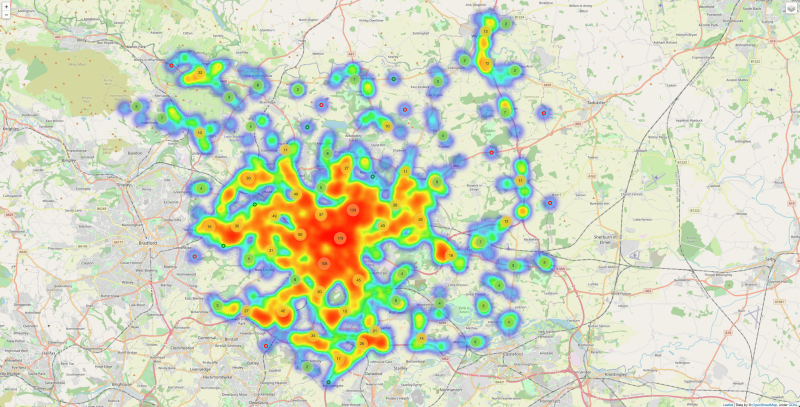
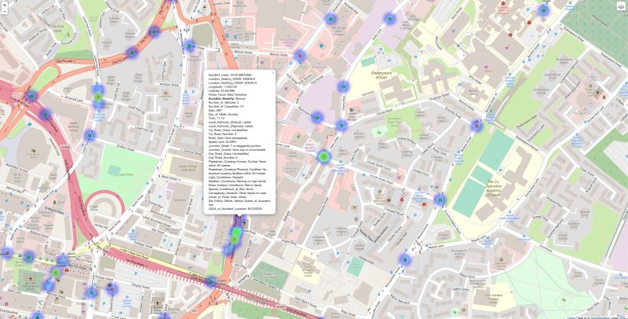
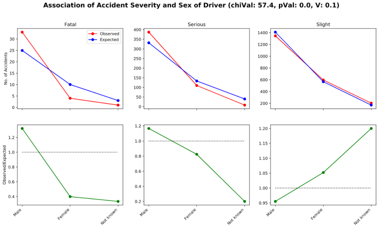
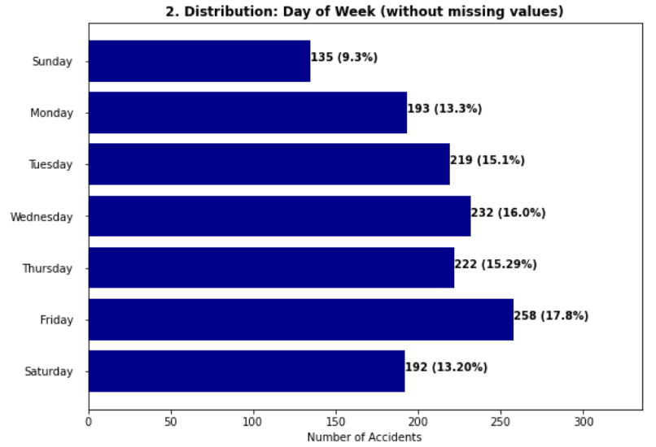

# Project 1: Spatial/ Urban Data Science
---
Group 9: Aidan Stocks, Christian Margo Hansen, Jonas-Mika Senghaas, Malthe Rødsgaard Pabst Lauridsen, Rasmus Bondo Hansen

## Project Description
In this project, we have completed tasks similar to data scientists working for a department of transport or a city government, to inform city leaders about traffic fatalities and injuries, and give insights for urban transport planning. We have explored and analysedthe latest data records of all recorded road collisions in Great Britain in the year 2019 provided by the UK Department of Transport with detailsabout the circumstances of personal injury. The major parts of the project are:
- Exploring and transforming the data, making numericaland visual reports
- Connecting data tables (accidents, vehicles, casualties)
- Investigating possible statistical associations by filtering for a variety of attributes
- Visualizing the data on a map
- Involving self-obtained external data sets in the analysis

## Background and Motivation
Promoting the use of cycling, walking, and public transportation as a means to navigate the city is part of the city ofLeeds’ plan to achieve being carbon neutral by 2030. The potential benefits of embracing, and advocating for, the widespread useof these means of transportation also extends towards increased road safety. With Leeds being the 9th most congested city in thewhole of UK, the local authorities need to take action to develop a future-proof urban mobility plan. This report sets the statisticalfoundation for data-driven policy to make the city greener and safer.

## Some Visualisations of the Project
### Spatial Visualisation
Whole of Leeds            |  Urban Area |  Specific Accident Inspection
:-------------------------:|:-------------------------:|:-------------------------:
   |  |  

### Statistical Analysis 
Example of Association (Pearson Chi Squared Test)            |  Example of Single Variable Analysis (Accident Frequency)
:-------------------------:|:-------------------------:
   | 